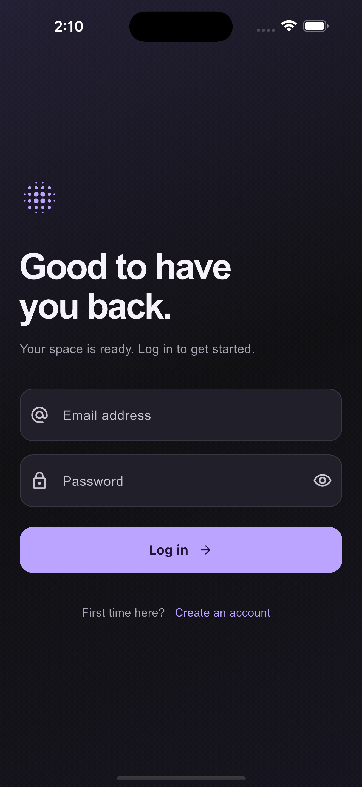
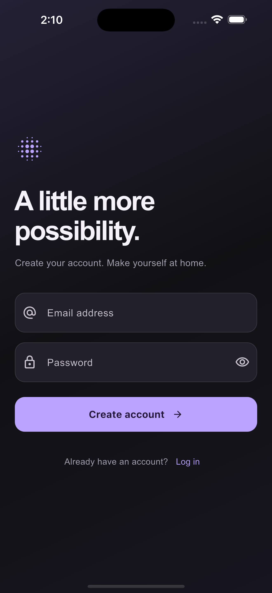
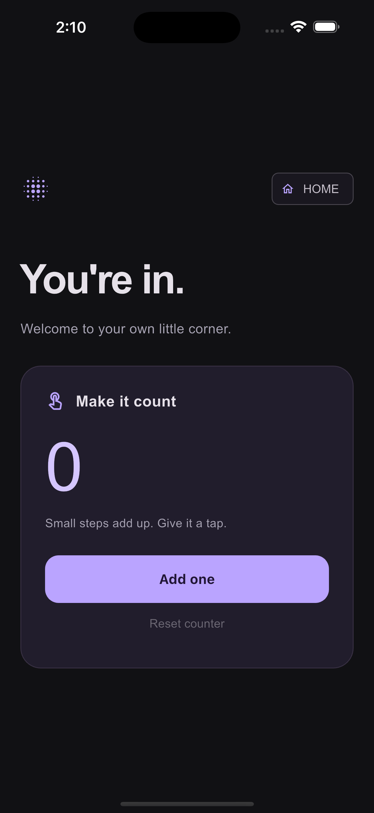

# Supabase Authentication

**Course:** Flutter Bootcamp — Tuwaiq Club

A Flutter app that signs users in with Supabase Authentication. After a successful email and password login, the app opens the Home screen.

## Screenshots

| Login | Sign up | Home |
| :---: | :---: | :---: |
|  |  |  |

## Features

- Consistent charcoal-and-violet theme across Login, Sign up, and Home.
- Email and password authentication through `Database.loginUser()`.
- Empty-field validation, loading state, and authentication error messages.
- Password visibility toggle.
- Sign-up screen for creating an account.
- Home screen with an interactive counter.

## Technologies

Flutter, Dart, Material 3, and `supabase_flutter`.

## Setup and run

1. Install Flutter and open this project folder in VS Code.
2. In `lib/main.dart`, configure `Supabase.initialize` with your project's URL and publishable key. This copy is already configured. Do not use a secret or service-role key in the app.
3. Run these commands from the project root:

```bash
flutter pub get
flutter run -d chrome
```

For another device, run `flutter devices`, then `flutter run -d <device-id>`.

## How login works

1. The app opens the Login screen.
2. The user enters an email and password and presses **Log in**.
3. `Database.loginUser()` calls Supabase's `signInWithPassword()` and waits for the result.
4. Successful authentication opens Home and removes previous Flutter routes.
5. Failed authentication displays a message and keeps the user on Login.

Passwords are verified by Supabase Authentication; the app does not compare passwords in a custom database table.

## Manual testing checklist

Use an account from the same Supabase project configured in `main.dart`.

| Test | Steps | Expected result |
| --- | --- | --- |
| Empty fields | Press Log in without entering anything. | A message asks for email and password; Home does not open. |
| Missing password | Enter only an email and press Log in. | The same validation message appears. |
| Password visibility | Type a password and press the eye icon. | The password switches between hidden and visible. |
| Incorrect password | Enter a registered email with an incorrect password. | An authentication error appears; the app stays on Login. |
| Successful login | Enter a registered, confirmed account's correct credentials. | The Home screen opens. |
| Home interaction | Press the Home screen's **Add one** button. | The counter increases from 0 to 1, then 2, and so on. |

### Creating a test account

1. On Login, select **Create an account**.
2. Enter an email you can access and a password meeting your Supabase project's password requirements.
3. Press **Create account**.
4. If email confirmation is enabled, open the confirmation email and confirm the account.
5. Return to the app and use the **log in** link on the Sign-up screen.
6. Log in using the same email and password.

The Sign-up screen displays registration feedback and authentication errors. After submitting, check your email if confirmation is required, then use the Log in link.

## Automated checks

```bash
flutter analyze
flutter test
```

The current three widget tests cover empty credentials, a missing password with password masking, and the Home counter. They passed, and the analyzer reported no issues at the latest code check.

These tests do not contact the live Supabase project. Successful and failed real-account login must still be checked manually using the steps above.

## Main files

- `lib/main.dart` — Supabase initialization, theme, and starting screen.
- `lib/service/database.dart` — Sign-up and login methods.
- `lib/screens/auth_screen.dart` — Shared login and registration interface, validation, and navigation.
- `lib/screens/login_screen.dart` — Login entry screen.
- `lib/screens/signup_screen.dart` — Registration interface with loading and error feedback.
- `lib/screens/home_screen.dart` — Home counter interface.
- `test/login_screen_test.dart` — Widget tests.

## Scope

This lab demonstrates login and navigation. It does not include logout, password reset, or automatic routing to Home when reopening the app with a saved session.

Based on the [class starter repository](https://github.com/FlutterBootCampTuwaiqClub26/day12-database-authentication).
